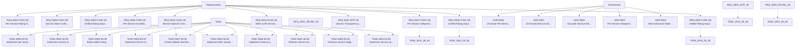

```mermaid
flowchart TD
    Requirements[Requirements]
    Tasks[Tasks]
    Architecture[Architecture]
    REQ_0001_FUNC_00["REQ-0001-FUNC-00<br/>Per-Service Rating D..."]
    Requirements --> REQ_0001_FUNC_00
    REQ_0002_FUNC_00["REQ-0002-FUNC-00<br/>Unified Rating Input..."]
    Requirements --> REQ_0002_FUNC_00
    REQ_0003_FUNC_00["REQ-0003-FUNC-00<br/>Service-Specific Com..."]
    Requirements --> REQ_0003_FUNC_00
    REQ_0004_FUNC_00["REQ-0004-FUNC-00<br/>Write to All Service..."]
    Requirements --> REQ_0004_FUNC_00
    REQ_0005_FUNC_00["REQ-0005-FUNC-00<br/>Service State Confli..."]
    Requirements --> REQ_0005_FUNC_00
    REQ_0006_FUNC_00["REQ-0006-FUNC-00<br/>Per-Service Scrobbli..."]
    Requirements --> REQ_0006_FUNC_00
    REQ_0007_FUNC_00["REQ-0007-FUNC-00<br/>Per-Service Independ..."]
    Requirements --> REQ_0007_FUNC_00
    REQ_0008_FUNC_00["REQ-0008-FUNC-00<br/>Unified Rating Input..."]
    Requirements --> REQ_0008_FUNC_00
    REQ_0009_FUNC_00["REQ-0009-FUNC-00<br/>Unified Rating Input..."]
    Requirements --> REQ_0009_FUNC_00
    REQ_0001_INTF_00["REQ-0001-INTF-00<br/>Service Transparency..."]
    Requirements --> REQ_0001_INTF_00
    TASK_0001_00_00["TASK-0001-00-00<br/>Refactor service arc..."]
    Tasks --> TASK_0001_00_00
    TASK_0002_00_00["TASK-0002-00-00<br/>Implement service st..."]
    Tasks --> TASK_0002_00_00
    TASK_0003_00_00["TASK-0003-00-00<br/>Implement AniList re..."]
    Tasks --> TASK_0003_00_00
    TASK_0004_00_00["TASK-0004-00-00<br/>Implement MAL rewatc..."]
    Tasks --> TASK_0004_00_00
    TASK_0005_00_00["TASK-0005-00-00<br/>Implement per-servic..."]
    Tasks --> TASK_0005_00_00
    TASK_0006_00_00["TASK-0006-00-00<br/>Build unified rating..."]
    Tasks --> TASK_0006_00_00
    TASK_0007_00_00["TASK-0007-00-00<br/>Create tabbed commen..."]
    Tasks --> TASK_0007_00_00
    TASK_0008_00_00["TASK-0008-00-00<br/>Implement write-to-a..."]
    Tasks --> TASK_0008_00_00
    TASK_0009_00_00["TASK-0009-00-00<br/>Enhance service badg..."]
    Tasks --> TASK_0009_00_00
    TASK_0010_00_00["TASK-0010-00-00<br/>Implement service-sp..."]
    Tasks --> TASK_0010_00_00
    ADR_0006["ADR-0006<br/>Universal Per-Servic..."]
    Architecture --> ADR_0006
    ADR_0007["ADR-0007<br/>Enhanced Service Ind..."]
    Architecture --> ADR_0007
    ADR_0008["ADR-0008<br/>Accurate Service Rat..."]
    Architecture --> ADR_0008
    ADR_0001["ADR-0001<br/>Per-Service Independ..."]
    Architecture --> ADR_0001
    ADR_0002["ADR-0002<br/>Most Advanced State ..."]
    Architecture --> ADR_0002
    REQ_0001_FUNC_00 -.-> TASK_0005_00_00
    REQ_0001_INTF_00 -.-> TASK_0009_00_00
    REQ_0001_INTF_00 -.-> TASK_0010_00_00
    REQ_0001_NFUNC_00 -.-> TASK_0001_00_00
    REQ_0002_FUNC_00 -.-> TASK_0006_00_00
    REQ_0002_INTF_00 -.-> TASK_0014_00_00
    REQ_0002_NFUNC_00 -.-> TASK_0013_00_00
    REQ_0003_FUNC_00 -.-> TASK_0007_00_00
    REQ_0004_FUNC_00 -.-> TASK_0008_00_00
    REQ_0005_FUNC_00 -.-> TASK_0002_00_00
    REQ_0006_FUNC_00 -.-> TASK_0003_00_00
    REQ_0006_FUNC_00 -.-> TASK_0004_00_00
    REQ_0007_FUNC_00 -.-> TASK_0011_00_00
    REQ_0008_FUNC_00 -.-> TASK_0012_00_00
    REQ_0009_FUNC_00 -.-> TASK_0015_00_00

```